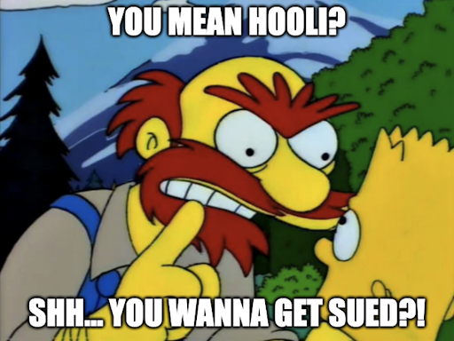

# Fooli Media

Your source for the dankest memes on the internet.

## Company History

Fooli was founded by our great leader Balvin Gelson. Fooli has been funded by Bessmer Venture Partners, Greycroft, and Andreessen Horowitz. It recently secured a mezzanine funding round of $160M from Bain Capital Venture, placing Fooli’s valuation at over US$8 Billion.

Taking a page from Jeff Bezos’s leadership principles which pushed Amazon’s great success, Fooli is a frugal company. From our CEO on down, Fooli will not spend money it doesn’t have to. This allows us to source the finest meme images and provides superior value to our customers.

Our memeologists regularly circle the globe to find new memes for Fooli. When they source sustainable conflict-free memes, they will deliver them straight into our meme factory for your enjoyment.

## What the hell is this really?

Fooli is a vulnerable by design web application used to teach cloud security principals. If you somehow stumbled across this page because you found something on the internet. Congratulations. I'm always curious what folks are doing in the area of bug bounty and cloud security research, but there isn't a bug bounty here.